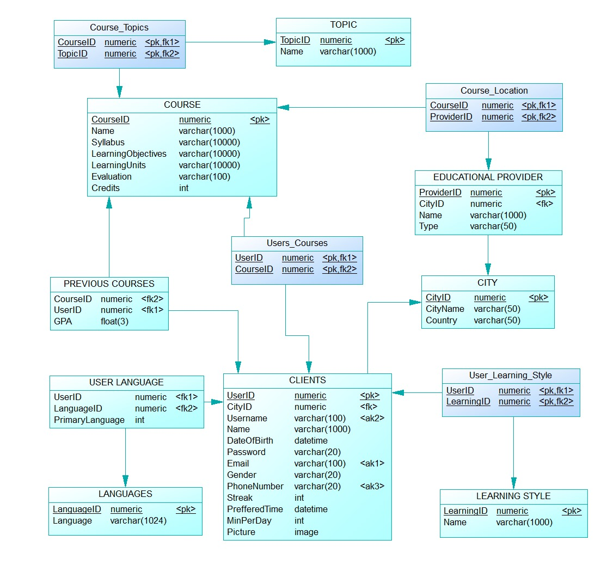
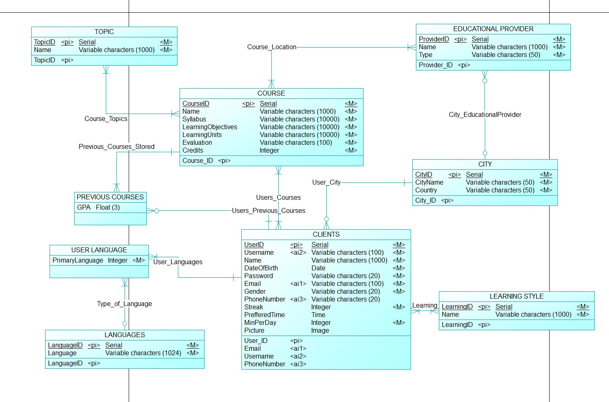

# Aurora 🦌 - Capstone Project 24/25

## Table of Contents
#### 1. [Project Overview](#1-project-overview)

#### 2. [How to Test the Chatbot](#2-how-to-test-the-chatbot)

#### 3. [Database Schema](#3-database-schema)

#### 4. [User Intentions](#4-user-intentions)

#### 5. [Intention Router](#5-intention-router)

#### 6. [Accuracy Testing Results](#6-accuracy-testing-results)

#### 7. [Repository Structure](#7-repository-structure)

## 1. Project Overview
- **Company Name:** Aurora
- **Group 7:**  João Capitão 20221863, Maria Rodrigues 20221938, Nuno Leandro 20221861, Vidhi Rajanikante 20221982, Yehor Malakhov 20221691.
- **Description:** 
   This project was created by students partaking their final year of Data Science Bachelor's at NOVA Information Management School.
   In lieu of the Capstone Project Course, a fictional company, Aurora, was created. 
   Aurora was created with the purpose of enhancing students’ academic journeys by leveraging AI for dynamic, personalized learning experiences that improve his/her engagement, motivation, and academic success. Aurora reaches to become the trusted, go-to study companion for students, offering a simple, engaging, and effective way to learn.

   Aurora was created to address the challenges students face with traditional educational tools, often lacking personalization, interactivity, and emotional support. The company's AI-powered chatbot serves as a personalized learning companion, offering tailored tools and resources to make studying and learning more effective and enjoyable.

   For more in-depth information visit **Aurora's website**: https://aurora4youcp.wixsite.com/aurora.

---

## 2. How to Test the Chatbot

### 2.1 Prerequisites

- **Python Version**: 3.9.21
- **Dependencies**:  
   All required libraries and frameworks can be checked in the [environment.yml](environment.yml) file in the repository.
- **Environment Setup**:  
   To ensure the functional, and successful, use of Aurora, make sure to set up an enviroment. Follow the steps below:

   #### 1. OpenAI API Key 
   Since Aurora will works using GenAI, an OpenAI API Key is necessary. To do so, create a `.env` file, with the key inside.
   ```
   OPENAI_API_KEY = "...key..."
   ```

   #### 2. Create Python Enviroment
   Then, to ensure the code runs smoothly, create a conda enviroment, to manage dependencies and packages. You will simultaneasly create the environment and install the necessary packages and versions of them. 

   First of all, please save the [environment.yml](environment.yml) file to your computer (i.e. Downloads). 
   Secondly, please open your *Anaconda Powershell Prompt*.

   To create your enviroment, it is needed to be inside the directory that you saved the [environment](environment.yml) file to. 
   ```
   cd .\Downloads\
   ```
   where `Downloads` is the folder you saved the requirements file.

   
   Then, run the following code to create your environment, and install the necessary dependencies:
   ```
   conda env create -f requirements.yml
   ```
   Where `env_group7` will be the name of the enviroment.

   #### 3. Activate Enviroment
   To activate the environment created, please open the repository from Github in your Visual Studio (VSCO). Then, open a new terminal (`Terminal > New Terminal`), and activate the environment you created:
   ```
   conda activate env_group7
   ``` 
   Hopefully, now, your enviroment is set up, and your are ready to run Aurora!      

   

### 2.2 How to Run the Chatbot

To open Aurora and start interacting with her, you first have to open the Streamlit App of Aurora.

```
streamlit run website/main.py
```
Great! When you enter, you should be in the Home Page, where you can see information regarding Aurora functionalities and purpose. In the sidebar, you can travel between the different pages (Home, Account, Chat, About). To interact with Aurora do the following:

<span style="color:red"> Disclaimer: </span> 
Aurora might take some time to open, and to answer queries. Be patient, and do not close the Streamlit App.

_"Breathe in; Breathe out. Smell the flower🌼; Blow the candle🕯️"_
   
   ### ➜ Sign In / Login
   If you do not already, create an account.

   To do so, please select the option 'Sign Up'. 
   It is mandatory to fill all fields. These are important, since they are crucial for Aurora to perform her best, and in accordance to your person. Make sure that the values for email and username are unique.

   Once you create an account, you will have to login again. So, please, select the option 'Login', and fill with your credentials. 

   Congratulations! You have succesfully logged in!

   _This step is mandatory in order to converse with Aurora. You will not be able to open the 'Chat' page otherwise._

   ### ➜ Interact With Aurora
   You are now ready to interact with Aurora! 
   Just open the 'Chat' Page, and ask her something. To see examples of Aurora's different capabilities, you can see below in section [User Intentions](#4-user-intentions).
   In case you cannot see the chat, scroll to the top of the page.
   
   Aurora will interact in the primary language defined when you created your account. However, you can always ask Aurora to speak to you in a different language in the chat.

   Remember that you can upload your pdf files. There are already 2 PDF files available for your use (one about biology and other about Text Mining) but feel free to add your own.

   Have a good study session with the best TeacherBot you will ever find!

   ### ➜ Logout
   After you have finish your study session, you can logout of your account. You can find this button on the sidebar on your 'Account' Page. 

   ### <span style="color:red">🚨 Warning 🚨</span>
   
   *Once you terminate your session, your conversations with Aurora will be lost, along with the files uploaded.*


---

## 3. Database Schema

### 3.1 Database Overview and Schema Diagram
Aurora's database structure consists of fifteen tables, five of which originate from a Many-to-Many relationship between entities that manages an educational system, connecting users (CLIENTS) with courses, education providers and academic resources. Courses are categorized by topics, linked to education providers, and located in specific cities. Academic papers are organized by topics and associated with providers. The schema ensures a personalized and organized approach to education with relationships between users, courses, topics, and providers. 

<figure style="text-align: center;">
   
   <figcaption>Figure 1: Aurora's Database Schema - Physical Model.</figcaption>
   
   <figcaption>Figure 2: Aurora's Database Schema - Conceptual Model.</figcaption>
</figure>


### 3.2 Table Descriptions

- **CLIENTS**
The table that stores the user's information is ‘CLIENTS’. It can be seen as the main entity in the
database. Moreover, only having a single identifier proves a bit vague; as such, this entity has one
primary identifier and another three alternative keys. The table’s attributes are as follows:
  - UserID: primary key, unique identifier for each user.
  - CityID: foreign key (‘CITY’), indicates the ID of the city where the user lives/is from. Ensures
  relationship between the ‘CLIENTS’ and the ‘CITY’ entities.
  - Username: alternative key, alternative unique identifier for each user. Each user can choose
  their own username, as long as it is unique.
  - Name: non-null attribute, represents the name of the user.
  - DateOfBirth: non-null attribute, represents the date of birth of each user.
  - Password: non-null attribute, represents the user-specified password for each user.
  - Email: alternative key, alternative unique identifier for each user. It is the email to which the
  user’s account is connected to.
  - Gender: non-null attribute, with three possible field values – Female, Male, Non-Binary and
  Prefer Not To Say.
  - PhoneNumber: alternative key, alternative unique identifier for each user. It is the phone
  number to which the user’s account is connected to.
  - Streak: non-null attribute, representing the number of consecutive days the user opens/uses
  Aurora for his/her studies.
  - PreferedTime: non-mandatory attribute, referring to the timetable when the user prefers or
  has the time to make use of Aurora’s services.
  - MinPerDay: non-null attribute, representing the minimum number of minutes the user wants
  to learn daily.
  - Picture: non-mandatory attribute, consisting of whether or not the user wants to upload a
  picture to his/her profile.

- **LEARNING STYLE**
‘LEARNING STYLE’ is a core entity that considers the ‘Names’ of different learning styles, provided by
the ‘CLIENTS’ to classify and match their preferences to make their experience personalized. Each type
of learning style has their own identifier.

- **COURSES**
The ‘COURSES’ entity can be considered another main entity, given it capability to store information
related to all the possible courses one can take. It takes a unique identifier, ‘CourseID’, the ‘Name’ of
the course, along with its ‘Field’, ‘Syllabus’, ‘LearningObjectives’, ‘LearningUnits’, ‘Evaluation’ metric
and guidelines, and ‘Credits’.

- **PREVIOUS COURSE**
‘PREVIOUS COURSES’ is an entity necessary to establish a personal connection between the COURSES
and CLIENTS, this is, the courses that the user has already taken. Thus, it stores the ‘GPA’ grade of the
user on the respective courses. It does not have any unique identifiers, having only as foreign keys the
primary keys from both the tables it is connected to: ‘CourseID’ and ‘UserID’.

- **USER_COURSES**
This table, ‘USER_COURSES’, originates from the Many-To-Many relationship between CLIENTS and
COURSES. It stores the courses the user is currently taking, keeping as its only attributes the primary
keys from both the tables it is connected to: ‘CourseID’ and ‘UserID’. Both these attributes are primary
keys and foreign keys.

- **LANGUAGES**
‘LANGUAGES’ maintains a list of all the languages supported by the chatbot to normalize the language
communication amongst users. It has a primary key, ‘LanguageID’, and the mandatory ‘Name’ of the
language.

- **USER LANGUAGE**
This entity shares a Many-to-One relationship with ‘LANGUAGES’ and ‘CLIENTS’. It associates the user’s
preferred language to normalize language data across the users and facilitate the explanation purposes
of the chatbot. It only consists of foreign keys because it solely associates the users with one or more
languages that they prefer to use when using the chatbot. It also has the ‘Default’ attribute as a bit to
set the preferred language to default or not as the user may juggle between different languages for
further explanation.

- **USER_LEARNING_STYLE**
The ‘USER_LEARNING_STYLE’ is a linking entity formed by a Many-to-Many connection between
‘CLIENTS’ and ‘LEARNING_STYLE’ to enable customized educational experiences.

- **EDUCATION PROVIDER**
The ‘EDUCATION PROVIDER’ table main purpose is to store the different entities that provide any sort
of course or education. It has as attributes a unique identifier, ‘ProviderID’, the ‘Name’ of the provider
(i.e. NOVA IMS) and the ‘Type’ of education it provides (i.e. online or in-person). Due to its connection
to CITY, it also has the foreign key of the information on the ‘CityID’ the education provider is located,
if applicable. In addition, it is necessary to relate the user educational needs presented to the chat and
the user location with the courses and articles that will be provided to the user that are stored in the
database.

- **COURSE_LOCATION**
Similar to USER_COURSES, this entity results from a Many-To-Many relationship between ‘EDUCATION
PROVIDER’ and ‘COURSE’. It only takes as attributes the primary keys from the tables it originates from,
making those also foreign keys.

- **CITY**
A core entity that stores the geographical location of the ‘CLIENTS’ and the ‘EDUCATION PROVIDER’,
simply having attributes such as ‘CityName’ and ‘Country’, as well as a primary key ‘CityID’. It is
essential to know about the origin or current geolocation of the ‘client’ and its ‘provider of education’
to simplify prompt delivery.

- **TOPIC**
The table ‘TOPIC’ contains the numerous topics that categorize the papers or courses, thus facilitating
filtering and organizing study content. It has an identity attribute, ‘TopicID’ and ‘Name’ where the topic
is specified.

- **COURSE_TOPIC**
Connecting the ‘COURSE’ and ‘TOPIC’ entities, this linking entity connects the courses to their
respective topics, thus simplifying topic-based course searches done by the model. As such, the table
‘COURSE_TOPIC’ only has two attributes: ‘CourseID’ and ‘TopicID’, both primary keys from the entities
previously mentioned.


---

## 4. User Intentions

### 4.1 Implemented Intentions

- **Creating Quizzes**: User intends to test their knowledge through quizzes generated based on the uploaded educational material.
- **Creating Flashcards**: User intends to review their studying through flashcards created based on previously learnt material or stored memory.
- **Update User Info from the Chat**: User inputs information to update their profile or preferences from chat interactions. 
- **Summarize from Uploaded Files**: User requests a summary of the uploaded files.
- **Citation of Provided Paper**: User requests the citations in a specified style, of academic or professional reports.
- **Motivational Support**: User is provided with motivational messages by Aurora for encouragement and engagement during their learning journey.
- **Recommendations and learning resources**: User requests for papers or additional resources to enhance their studies.
- **Study Planning**: users asks for a study plan that meets their needs and preferences
- **Send Email**: users requests to send an email to someone

### 4.2 How to Test Each Intention


### ➜ Creating Quizzes 

   **Test Messages:**

   1. 'Can you create a quiz from the pdf on Deep Learning?'
   2. 'Generate multiple choice questions based on genetic analysis.'
   3. 'Test my knowledge with a quiz using the last article I uploaded.'

   **Expected Behavior:**  
   The chatbot should generate quizzes compiled of multiple choice or true/false questions based on the educational material uploaded by the users.

### ➜ Creating Flashcards 

   **Test Messages:**

   1. 'Create flashcards from the pdf on Optimization Algorithms.'
   2. 'Please make flashcards on the pdf I uploaded about accounting'
   3. 'May you create flashcards that I can use to review all that I have studied on Marketing Analysis?'

   **Expected Behavior:**  
   The chatbot should create flashcard pairs, such as term/definition, based on past learnt material by the user by retrieving key points and terms from the uploaded files.


### ➜ Update User Info from the Chat

   **Test Messages:**

   1. 'Change my goal of minutes to learn to 30 minutes.'
   2. 'Set my preferred time to study to be at 19:00'
   3. 'Please update my profile with the following username: lonewizard007'

   **Expected Behavior:**  
   The chatbot should update user's profile and learning preferences by implementing a converational chain to analyse user inputs for profile-related information.

### ➜ Summarize from Uploaded Files

   **Test Messages:**

   1. 'Please summarize the pdf on Text Mining I just uploaded.'
   2. 'Give me a brief overview of the second section of the Social Sciencs pdf'
   3. 'Condense this PDF into key points for me please.'

   **Expected Behavior:**  
   The chatbot should extract content from various file types where a summarization tool condenses the extracted test into key points or short overview.

### ➜ Citation of Provided Paper

   **Test Messages:**

   1. 'Can you provide me with the APA citation style for the paper on biology I uploaded?
   2. 'Generate citations for the the uploaded academic paper.'
   3. 'Give me an Chicago citation style for the paper on NLP.'

   **Expected Behavior:**  
   The chatbot should extract and format bibliographic details such as its author(s), title and publication date into the user-specified citation style.

### ➜ Motivational Support

   **Test Messages:**

   1. 'I just feel like giving up'
   2. 'I feel overwhelmed with this content. May you motivate me with positivity?'
   3. 'Do you think I deserve a 15-minute break after this quiz?'

   **Expected Behavior:**  
   The chatbot should analyze user inputs or their progress data to determine an appropriate motivational response.

### ➜ Reccomendations and Learning Resources

   **Test Messages:**

   1. 'Can you suggest some learning resources for Computer Architecture?'
   2. 'What papers can help me understand Machine Learning better?'
   3. 'Give me resources to study Chemistry'

   **Expected Behavior:**  
   The chatbot should analyze user inputs and be able to provide accurate recommendations of papers to help the user in their study journey.

### ➜ Study Planning

   **Test Messages:**

   1. 'Please generate a weekly study routine for me to learn Machine Learning?'
   2. 'Create me a weekly schedule. I only want to work 4 days per week'
   3. 'Build me a study plan for me to focus on both Marketing and Design'

   **Expected Behavior:**  
   The chatbot should analyze user inputs and the user preferences, namely their minutes studying goal and their preffered time (stored in clients table) and create a personalized study plan.

### ➜ Send Email

   **Test Messages:**

   1. 'Compose an email asking for details on the Chatbot to João Capitão, the CEO of Aurora'
   2. 'Please end a cover letter to HR or aurora'
   3. 'Can send an email asking a doubt to the Head of coding department of Aurora?'

   **Expected Behavior:**  
   The chatbot should identify the recipient specified by the user and send the email accordingly.
   Note that for this functionality to work as intended, API access would be crucial. Without it, there may be limitations in accurately identifying emails.

---
## 5. Intention Router

### 5.1 Intention Router Implementation

- **Message Generation**:  
   The messages for each user intention were generated manually. For each intention, a list of sample messages was crafted to reflect the variety of ways users might phrase their requests. This was made to capture the different linguistic expressions and scenarios relevant to the specific intentions. The descriptions of each intention were also defined to clarify the purpose and context of the messages.

   The generated messages, along with their corresponding intentions, were stored in a JSON file named `intentions.json`. 

### 5.2 Semantic Router Training

- **Hyperparameters**:  
  To train the semantic router, the `OpenAIEncoder` was used, which generated the embeddings of the input messages. 

  The aggregation method applied was the `mean`, with `top_k` parameter set to selecting the top **3** most relevant results.

### 5.3 Post-Processing for Accuracy Improvement

- **Post-Processing Techniques**:  
   No post-processing techiniques were applied, to refine the model.

---

## 6. Accuracy Testing Results

### Methodology

1. **Message Creation**:
   A total of 500 messages were created in regards to the user intentions, 50 for each of the intentions. Another 100 messages are created: 50 small-talks related to Aurora and 50 off-topics unrelated to Aurora which are labeled as 'None'. Therefore, a total of 600 messages were created.

2. **Data Splitting**:
   We split the data into training and test sets, allocating 85% for training and 15% for testing. We ensured the stratification of the intentions to maintain consistency across both the training and test sets.

3. **Training the Semantic Router**:
   We trained the semantic router using the training set and evaluated its accuracy on the test set.

4. **Reporting Results**:

### Results
```
| Intention                              | Test Inputs | Correct | Incorrect | Accuracy (%) |
|----------------------------------------|-------------|---------|-----------|--------------|
| study_planning                         | 8           | 6       | 2         | 75%          |
| recommendations_and_learning_resources | 7           | 6       | 1         | 85.71%       |
| motivational_support                   | 8           | 6       | 2         | 75%          |
| creating_quizzes                       | 7           | 6       | 1         | 85.71%       | 
| creating_flashcards                    | 8           | 7       | 1         | 87.50%       |
| summarize_file                         | 7           | 5       | 2         | 71.43%       |
| update_user_info                       | 7           | 6       | 1         | 85.71%       |
| generate_citation                      | 7           | 7       | 0         | 100%         |
| aurora_related                         | 8           | 8       | 0         | 100%         |
| send_email                             | 8           | 8       | 0         | 100%         |
| None                                   | 8           | 8       | 0         | 100%         |
| **Average Accuracy**                   | 83          | 73      | 10        | 87.95%       |
```


## Repository Structure
```
root/
├── .streamlit/                                                                                           # Streamlit initializatin«on
│    ├── config.toml                                                                                      # Configurations on Streamlit
├── agents/                                                                                               # Contains agents files
│    ├── agent_citations.py                                                                               # Agent to give citations
│    ├── agent_quizz.py                                                                                   # Agent to create quizzes
│    ├── agent_resource.py                                                                                # Agent to get resources
│    └── agent_userinfo.py                                                                                # Agent to get/change user information
├── aurora/                                                                                               # - 
│    ├── Include                                                                                          # -
│    ├── Lib \site-packages                                                                               # -
├── files/                                                                                                # Contains various files used 
│    ├── database_schemas/                                                                                # Images of database schema
│    │    ├── aurora_conceptual_model.jpg                                                                 # Image of conceptual model
│    │    └── aurora_physical_model.jpg                                                                   # Image of physical model
│    ├── pinecone_pdfs/                                                                                   # PDFs used in pinecone
│    │    ├── A_Collaborative_Human-AI_Guided_Decision_Framework_-_Gen-Edge-AI.pdf                        # PDF file
│    │    ├── Columbia_law_review.pdf                                                                     # PDF file
│    │    ├── Exploring_Systems_Biology_Approaches_to_Traditional_Chinese_Medicine_Cancer_Research.pdf    # PDF file
│    │    ├── Gimme Some Truth AI Music and Implications for Copyright and Cataloging..pdf                # PDF file
│    │    ├── Looking beyond effectiveness Integration of social science research within international    
│    │    │    infectious disease research in primary care..pdf                                           # PDF file 
│    │    ├── Marketing.pdf                                                                               # PDF file
│    │    ├── New_Physics_Searches_with_Isotope_Shifts_of_Two_Hg_Clock_Transitions.pdf                    # PDF file
│    │    ├── Perceived coaches' health promotion activity, maintenance of participation in sports, 
│    │    │    and lifestyle habits among emerging adults.pdf                                             # PDF file
│    │    └── The_effect_of_mobile_games_on_math_learning_of_third_graders_of_elementary_schools.pdf      # PDF file
│    ├── Aurora_info.pdf                                                                                  # PDF on Aurora's information
│    ├── aurora.db                                                                                        # Database for Aurora
│    ├── intentions.json                                                                                  # Contains intentions for router
│    └── layer.json                                                                                       # From router, helps bot to choose intention
├── user_files/                                                                                           # Example files uploaded by user
│    ├── Introduction to Biology.pdf                                                                      # PDF file
│    └── Report_TM_1.pdf                                                                                  # PDF file
├── website/                                                                                              # Contains pages for Streamlit App
│    ├── images/                                                                                          # Images used in Streamlit App
│    │    ├── coquette.png                                                                                # PNG image
│    │    ├── logo_full.png                                                                               # PNG image
│    │    ├── logo.png                                                                                    # PNG image
│    │    └── white image.png                                                                             # PNG image
│    ├── about.py                                                                                         # File for 'About' page
│    ├── account.py                                                                                       # File for 'Account' page
│    ├── home.py                                                                                          # File for 'Home' page
│    └── main.py                                                                                          # Main Script of Streamlit App
├── .env                                                                                                  # Contains API key
├── add_to_pinecone.ipynb                                                                                 # File used in pinecone implementation
├── requirements.yml                                                                                       # Create environment with dependencies
├── README.md                                                                                             # Comprehensive project documentation
├── res_fun.py                                                                                            # File with results of functions
├── routergen.ipynb                                                                                       # Contains router creation
└── session.py                                                                                            # File for 'Chat' bot page
```
